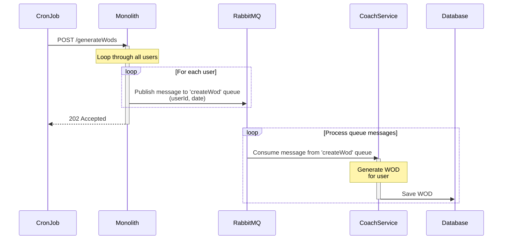

# Students assignment 2

## Before starting

- Update your repository to track upstream

```
git remote add upstream https://github.com/wayglem/fit-company.git
git fetch upstream
git checkout -b queue-communication upstream/queue-communication
```

- All your work should be on queue-communication branch
- Make sure the project is running with `docker-compose up` You don't need to run anything else.
- Test the different services endpoints using the Bruno collection.
- Expected opened pull-request on upstream/queue-communication before Tuesday 2025-06-10T20:00:00.Z

## Grade

- Grade:
  - 2 point working implementation
  - 1 point on choices explanation
  - Up to 1 bonus point on best practices implementation

## Queue create wod

During a coffee break with the product team, you start to realize that there is no need to wait for the user to request a WOD, we could create all users WODs at the same time.

Coming back to your desk, you start to think about how to implement this.

You decide to use a queue to create the WODs.

- Add a rabbitmq container to the docker-compose
- create a queue createWodQueue and define the message format
- Create an API endpoint in the monolith that will loop through all users and create a create WOD job for each user
- Create a queue consumer in the coach service that will listen to the queue and create a WOD
- Change coach service to persist the generated WOD for when the user requests a WOD
- Create a script called cron_job.py that will call the API endpoint to create a WOD for all users

Here's how the system will work:



### Step 1: RabbitMQ

Use docker image `rabbitmq:3-management` and expose the ports `12104:5672` and `12105:15672`.

Connect to the management interface at `http://localhost:12105` to see the queues and messages.

Discover the management interface and create a queue called `createWodQueue`.

Create a few messages in the queue.

### Step 2: Create queue programatically

- Delete the previously created queue
- Create a rabbitmq service in the monolith that will create a queue called `createWodQueue`
- queue requirements:
  - Messages should stay in the queue for 1 minutes.
  - Messages should be deleted after 100 messages.
  - Failed messages should be retried 3 times.
  - Failed messages should be moved to a dead letter queue.
- Define the message format and write a validation for it

### Step 3: Create producer in the monolith

- Create an API endpoint in the monolith that will loop through all users and create a create WOD job for each user
- Create a few users in the database
- Call the API endpoint to create a WOD for all users notice that the messages are in the queue and will disappear after 1 minute

### Step 4: Create consumer in the coach service

- Create a queue consumer in the coach service that will listen to the queue and create a WOD
- Change coach service to persist the generated WOD for when the user requests a WOD
- Create an API endpoint in the coach service that will return the generated WOD for a user

### Step 5: Validate the system

- Change the coach service adding a 20% random failures to the WOD generation
- Create a few users in the database
- Call the API endpoint to create a WOD for all users
- Check that failed messages are retried
- Raise the random failures percentage and check that failed messages are moved to a dead letter queue

### Step 6: Create a cron job in the monolith

- Create a script called cron_job.py that will call the API endpoint to create a WOD for all users

### Step 7: Write a short document explaining how you could improve the system

- Create file `adr/03-queue-create-wod.md`
- Document the choices you made to implement the system (only document the ones that were not required by the assignment)
- Document how you could strengthen the system even more

### Step 8: Create a pull request

- Create a pull request to the origin main branch

## Submission

- Create a pull request to the origin `wayglem/fit-monolith` main branch. PR should contain:
  - `adr/02-queue-create-wod.md` as explained in step 7
  - working implementation of the system

## Bonus points

- Create a script that will consume the dead letter queue and retry the messages
- Create a system to raise an alert if the queue is almost full
