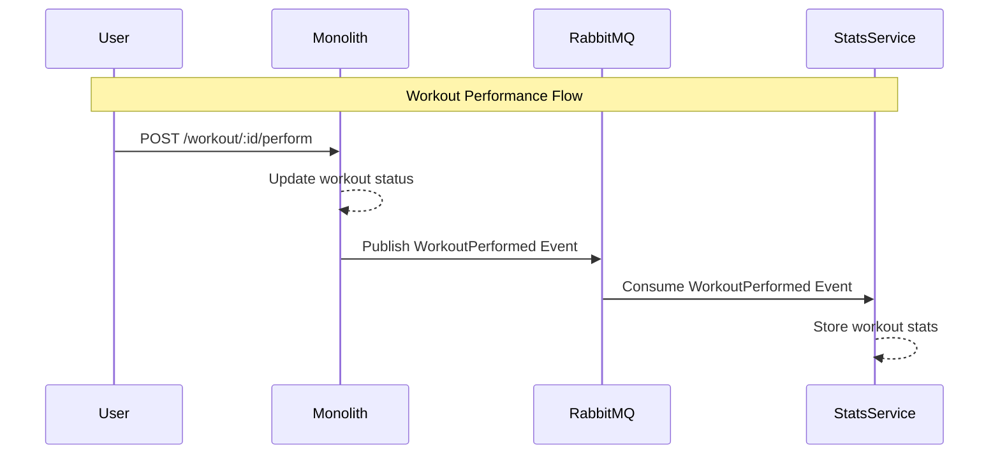

# Students assignment 3

## Before starting

- Create a branch in your current repository called eda-communication.
- All your work should be on eda-communication branch

## Grade

- This assignment will not be reviewed on its own, it will be part of the final grade.
- There is no expected submission.

## Event Driven Architecture

A new feature has been requested by the product team.

They want to track the user's progress and provide a dashboard to the users they call the stats service.

The idea is to register every exercise performed by the user and store it in a new service.

Management want to split the development into 3 independent teams, they are counting on you to implement a design that will allow monolith team, coach team and stats team to work independently.

You decide to use an event driven architecture to implement this. Every time a user performs a workout, the coach service will publish an event. The stats team will listen to the queue and store the data in its database. The monolith team will also listen to the event and save last workout.

## Step 1: Create a new service called stats service

- Setup a new flask app in the `src/stats` folder
- Create a docker file and a docker compose file for the stats service and its database (postgres)

- Define how you would store the workout stats in the database
- Create a simple API endpoint to return the workout statistics

## Step 2: Create a new rabbitmq exchange called workout.performed

- Create a new exchange called workout.performed of type fanout
- Define the message format for the workout performed event

## Step 3: Publish the workout performed event

- When a user performs a workout, the coach service will publish an event to the workout.performed exchange

## Step 4: Create a consumer in the stats service

- Create a consumer in the stats service that will subscribe to the workout.performed exchange
- Define the database model to store the workout stats
- Create a service to store the workout stats in the database

## Step 5: Create a simple API endpoint to return the workout statistics

- Create a simple API endpoint to return the workout statistics
